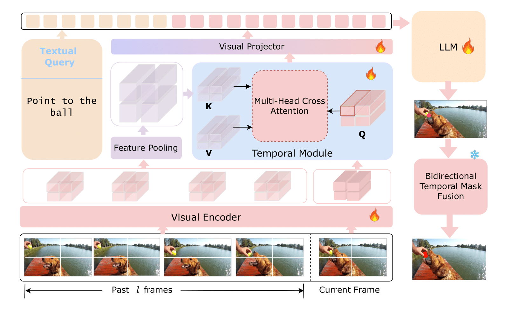
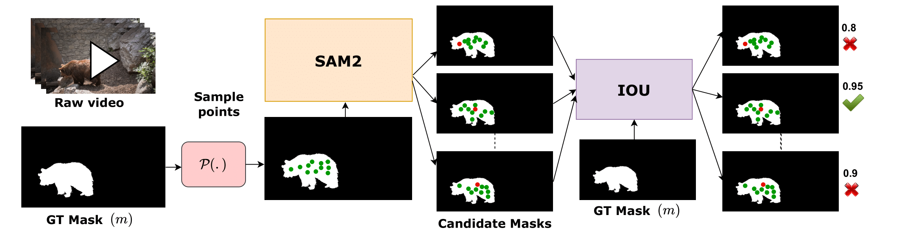
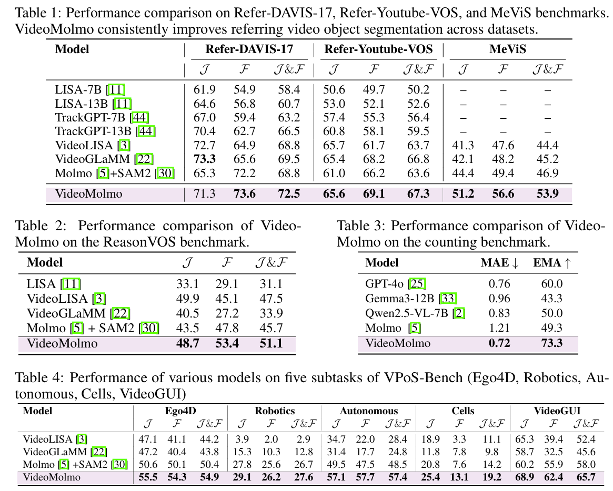

# VideoMolmo: Spatio-Temporal Grounding meets Pointing

<div align="left" style="margin:24px 0;">
  
</div>

<p align="center">
  <a href="https://mbzuai-oryx.github.io/VideoMolmo/"></a>
  <a href="https://arxiv.org/abs/2411.04923"></a>
</p>

<p align="center">
  <b>Ghazi Shazan Ahmad</b><sup>*</sup>, <b>Ahmed Heakl</b><sup>*</sup>, 
  <b>Hanan Gani</b>, <b>Abdelrahman Shaker</b>,<br> 
  <b>Ranjay Krishna</b>, <b>Fahad Shahbaz Khan</b>, <b>Salman Khan</b>
</p>


<p align="center">
  <b>MBZUAI</b> · <b>University of Washington</b> · <b>Allen Institute for AI</b> · <b>Linköping University</b> · <b>ANU</b>
</p>

<p align="center"><sup>*</sup>Equal Technical Contributions</p>

---

## 🆕 Latest Updates

- 📢 **May 2025**: Paper and inference code released!


## 📊 Overview

<p align="center">
  
</p>

**VideoMolmo** is a a large multimodal model tailored for fine-grained spatio-temporal pointing conditioned on textual descriptions. Building upon the Molmo architecture, VideoMolmo incorporates a temporal module utilizing an attention mechanism to condition each frame on preceding frames, ensuring temporal consistency. Additionally, our novel temporal mask fusion pipeline employs SAM2 for bidirectional point propagation, significantly enhancing coherence across video sequences. This two-step decomposition i.e., first using the LLM to generate precise pointing coordinates, then relying on a sequential mask-fusion module to produce coherent segmentation, not only simplifies the task for the language model but also enhances interpretability. Due to the lack of suitable datasets, we curate a comprehensive dataset comprising 72k video-caption pairs annotated with 100k object points. To evaluate the generalization of VideoMolmo, we introduce VPoS-Bench, a challenging out-of-distribution benchmark spanning five real-world scenarios: Cell Tracking, Egocentric Vision, Autonomous Driving, Video-GUI Interaction, and Robotics. We also evaluate our model on Referring Video Object Segmentation (Refer-VOS) and Reasoning VOS tasks. In comparison to existing models, \method substantially improves spatio-temporal pointing accuracy and reasoning capability.

---
## 🏆 Highlights
Key contributions of **VideoMolmo**:
1. We introduce VideoMolmo , an LMM that accepts natural-language queries and produces point-level predictions for target objects across entire video sequences, ensuring temporal consistency.

2. We further introduce Temporal module to leverage past temporal context and propose a novel temporal mask fusion pipeline for enhanced temporal coherence.

3. To achieve fine-grained spatio-temporal pointing, we introduce a comprehensive dataset of 72k video-caption pairs and 100k object points.

4. To evaluate the generalization of VideoMolmo, we introduce VPoS-Bench, a challenging out-of-distribution benchmark spanning five real-world scenarios: Cell Tracking, Egocentric Vision, Autonomous Driving, Video-GUI Interaction, and Robotics. We also assess our model on Referring Video Object Segmentation (Ref-VOS) and Reasoning VOS tasks.

---
## Architecture

<p align="center">
  
</p>

**VideoMolmo** consists of four end-to-end trainable components: (1) a visual encoder, (2) a temporal module, (3) visual projector (4) a decoder-only large language model (LLM); and a post-processing module.

---
## Benchmark and Annotation Pipeline

<p align="center">
  
</p>

We propose a semi-automatic annotation pipeline for creating a grounded conversation generation (GCG) dataset for videos.

---

## 📈 Results


> |1| **VideoMolmo** demonstrates robust generalization and fine-grained spatio-temporal grounding across diverse out-of-distribution scenarios from our proposed benchmark, for instance, correctly pointing to traffic lights (2nd row) in challenging driving scenes despite never encountering such scenarios during training.
<p align="center">
  
</p>


> |2| Quantative results showing VideoMolmo with average improvement of 4.1% over SoTA (VideoGLaMM) and 4.8% over our baseline (Molmo+SAM2). 
<p align="center">
  
</p>


---

## 🔧 Running VideoMolmo 

### Environment setup

(1) Setup environment and PyTorch
```bash
git clone https://github.com/mbzuai-oryx/VideoMolmo
cd VideoMolmo
conda create -n .videomolmo python=3.10 -y
conda activate .videomolmo
pip install torch==2.5.1 torchvision==0.20.1 --index-url https://download.pytorch.org/whl/cu121
```

(2) Setup Molmo
```bash
git clone https://github.com/allenai/molmo.git
cd molmo && pip install -e .[all] && cd .. # setup molmo requirements
pip install -r requirements.txt
```

(3) Setup SAM
```bash
python setup.py build_ext --inplace # build sam2
mkdir -p sam2_checkpoints
wget https://dl.fbaipublicfiles.com/segment_anything_2/092824/sam2.1_hiera_large.pt -O sam2_checkpoints/sam2.1_hiera_large.pt
```

### 🔄 Inference

To run inference on the provided sample video:

```bash
python infer.py \
  --video_path ../examples/video_sample1 \
  --prompt "point to the person in red shirt" \
  --save_path "results"
```

Your video should be a folder with all the frames. Sample structure:
```
video_sample1/
├── frame_0001.jpg
├── frame_0002.jpg
├── frame_0003.jpg
└── ...
```

Output includes segmentation masks for each frame and a JSON file (`points.jsonl`) containing point coordinates.
```
reuslts/
├── video_sample1/
│   ├── frame_0001.jpg
│   ├── frame_0002.jpg
│   ├── frame_0003.jpg
│   ├── points.jsonl
│   └── ...
└── ...
```
### Training and Evaluation 🚀

To be released soon! Stay tuned for updates.


## Todos

- [ ] Release training and evaluation scripts.
- [ ] Add support for additional datasets.
- [ ] Release dataset creation pipeline.


## Citation 📜

```bibtex
@article{ghazi2025videomolmo,
  title={VideoMolmo: Spatio-Temporal Grounding meets Pointing}, 
  author={Ghazi Ahmad, Ahmed Heakl, Hanan Ghani, Abdelrahman Shaker, Ranjay Krishna, Fahad Shahbaz Khan, Salman Khan},
  year={2025}
}
```

---

[](https://mbzuai.ac.ae)
[](https://allenai.org/)
[](https://www.washington.edu/)
